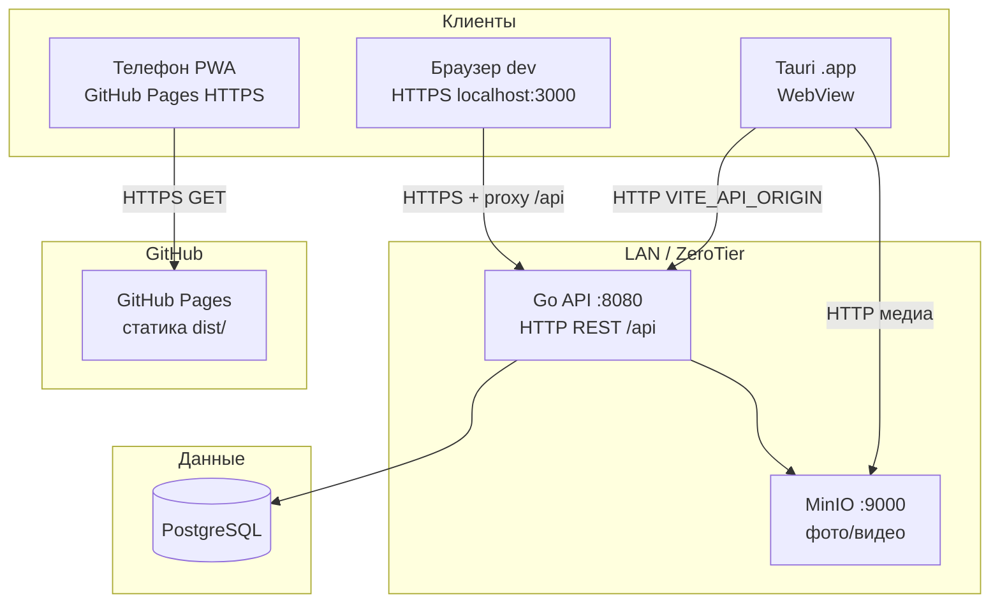
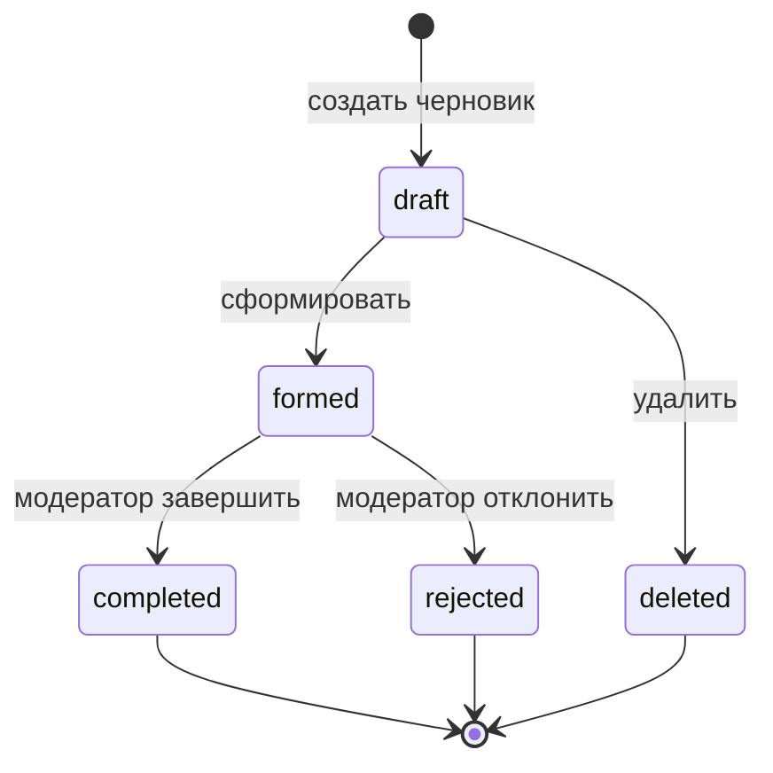
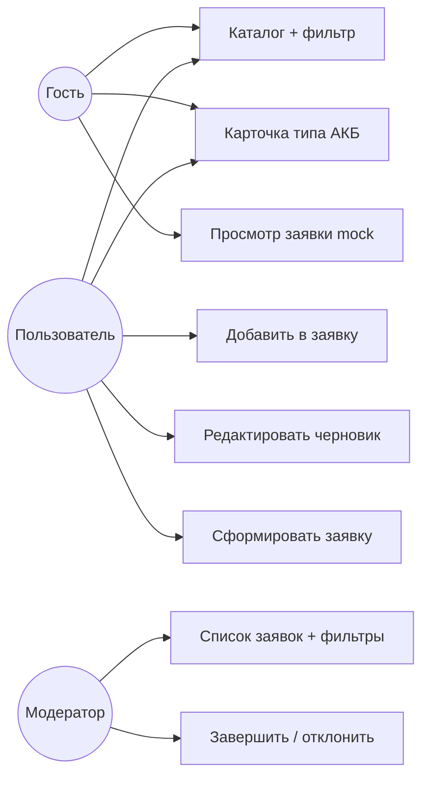

# Лаб. 8 — порядок показа и шпаргалка к защите

Проект: `RIP-battery-life-frontend`  
Pages: https://kluv1n.github.io/RIP-battery-life-frontend/

---

## 1. Порядок показа (как в задании)

| # | Что показать | Как у тебя |
|---|--------------|------------|
| 1 | **Телефон:** GitHub Pages + mock, сохранить **PWA** | `deploy:gh-pages` → Safari/Chrome «На экран Домой» |
| 2 | **PWA:** фильтр → карточка → назад, **фильтр на месте** | Redux `catalogFilters.title`, DevTools action `setCatalogTitleFilter` |
| 3 | **Адаптив:** DevTools, ширина → **3 → 2 → 1** колонки | `lab-index-style.css` — см. §3 |
| 4 | **ПК:** Pages + **бэкенд** | На защите чаще: `npm run dev` + proxy `/api` → `localhost:8080` |
| 5 | **Tauri release** (не dev) + API по **LAN IP** | `.env.tauri` → `npm run tauri:build:app` → `.app` |
| 6 | Сравнить IP: `ipconfig getifaddr en0` и `.env.tauri` | `VITE_API_ORIGIN=http://192.168.x.x:8080` |
| 7 | **Wireshark / tcpdump** — трафик на **:8080** | На одном Mac: `lo0`, фильтр `tcp.port == 8080` или `host IP and port 8080` |
| 8 | Правка **БД** → обновление в Tauri | Adminer/psql, таблица типов АКБ, перезапуск списка |
| 9 | **HTTPS** локальный фронт | `npm run dev:https` → `https://localhost:3000` |

---

## 2. Redux — фильтр услуг

| Часть | Файл |
|-------|------|
| Slice | `src/store/slices/catalogFiltersSlice.ts` — поле `title` |
| Store | `src/store/index.ts` — `catalogFilters` |
| UI | `ServicesPage.tsx` → `setCatalogTitleFilter` |
| DevTools | F12 → Redux → state `catalogFilters.title` |

**Сценарий:** ввести текст в поиск → открыть тип АКБ → «Назад» → строка поиска **не пустая**.

---

## 3. Адаптивность — конкретные значения

Файл: **`src/lab-index-style.css`** (+ `ServiceCard/ServiceCard.css`, `BatteryLifePage.css`).

### Каталог (3 страницы: каталог, тип АКБ, заявка-гость)

| Экран | Колонок `.container` | Breakpoint |
|-------|----------------------|------------|
| Desktop | **3** | `> 992px` — `repeat(3, 1fr)`, `gap: 32px` |
| Планшет | **2** | `@media (max-width: 992px)` |
| Телефон | **1** | `@media (max-width: 640px)` |

Карточка (`ServiceCard.css`): `min-height: 460px`, фото `300px`, `border-radius: 16px`.

### Страница типа АКБ

| Ширина | Раскладка |
|--------|-----------|
| `> 640px` | `.detail-card--split` — 2 колонки |
| `≤ 640px` | 1 колонка |

### Страница заявки

| Ширина | Таблица позиций |
|--------|-----------------|
| `> 900px` | 7 колонок (+ «Действия» в черновике) |
| `≤ 900px` | 2 колонки, подписи через `::before` |

Подробнее: `LAB8_RESPONSIVE.md`.

---

## 4. GitHub Pages + PWA

| Что | Где |
|-----|-----|
| Base path | `VITE_BASE_PATH=/RIP-battery-life-frontend/` (mode `pages`) |
| Сборка | `npm run build:pages` → `404.html` = копия `index.html` |
| Деплой | `npm run deploy:gh-pages` |
| PWA manifest | `vite.config.ts` / `pagesManifestOnlyPlugin` (без тяжёлого SW на Pages) |
| Mock без API | `runtimeConfig.ts` → `isGitHubPagesDeploy()` |

На телефоне **без бэка** — mock из `src/modules/mock.ts`, одно фото `battery-default.*`.

---

## 5. Tauri (гость, 3 страницы)

| Что | Где |
|-----|-----|
| Маршруты | `AppGuest.tsx` — каталог `/`, тип `/battery/:id`, заявка `/battery-life/:id` |
| Сборка | `npm run tauri:build:app` |
| `.app` | `src-tauri/target/release/bundle/macos/Battery Life Guest.app` |
| API по IP | `.env.tauri`: `VITE_API_ORIGIN`, `VITE_TAURI_USE_LAN_IP=true` |
| HTTP в webview | `src/modules/tauriHttp.ts` |

**Не показывать `tauri dev`** — только **release .app**.

После смены Wi‑Fi: `npm run tauri:run` (IP с `en0` + пересборка).

---

## 6. IP и Wireshark

```bash
ipconfig getifaddr en0          # твой Wi‑Fi IP
lsof -iTCP:8080 -sTCP:LISTEN    # API слушает?
```

Tauri ходит на **порт API 8080**, не «порт Tauri».  
На **одном Mac** трафик часто на **loopback (`lo0`)**, не на Wi‑Fi:

```bash
sudo tcpdump -i lo0 host 192.168.x.x and port 8080 -c 5
```

---

## 7. HTTPS

```bash
brew install mkcert && mkcert -install
npm run dev:https
```

→ `https://localhost:3000`. См. `LAB8_HTTPS.md`.

---

## 8. ZeroTier (если требуют)

Сейчас у тебя **сеть не подключена** (`zerotier-cli listnetworks` пусто).

```bash
"/Library/Application Support/ZeroTier/One/zerotier-cli" join NETWORK_ID
```

Препод **Authorize** узел → IP `10.147.x.x` → тот же `.env.tauri`.

Если ZeroTier не заведётся — показывай **LAN IP** (п.6), это обычно принимают.

---

## 9. Short Polling

`BatteryLivesPage.tsx` — обновление списка заявок каждые **4 с**:

```ts
window.setInterval(load, 4000);
```

---

## 10. Контрольные вопросы (кратко)

**Flux:** action → dispatcher → store → view (однонаправленный поток).  
**Redux:** store, action `{type, payload}`, dispatch, reducer (чистая функция). Async — thunk.  
**PWA:** сайт + manifest (+ SW); установка на экран; offline/кэш.  
**Tauri:** WebView + Rust, бинарник, не Electron.  
**Pages:** статика с GitHub, `BASE_URL`, `404.html` для SPA.

Полнее: `../KONTROLNYE_VOPROSY_15MIN.md`.

---

## 11. Deployment-диаграмма (узлы)



**Протоколы:** HTTPS (Pages, dev), HTTP (API, MinIO в LAN), REST JSON `/api/...`.

**Компоненты фронта в узле клиента:** React, Redux (`catalogFilters`, `batteryLifeApplication`, `user`), React Router, axios/`batteryApi.ts`.

**Компоненты бэка:** handlers, JWT, swagger — `RIP2026-lab4_auth_swagger`.

---

## 12. Диаграмма состояний — статусы заявки



Код: `applicationStatusLabel.ts`, API поле `battery_life.status`.

---

## 13. Диаграмма прецедентов (React UI)



Tauri = только левая ветка (гость). Полное приложение = все три роли.

---

## 14. Чеклист перед защитой

- [ ] `deploy:gh-pages` актуален, PWA на телефоне
- [ ] Redux DevTools — фильтр сохраняется
- [ ] 3/2/1 колонки в DevTools
- [ ] Tauri `.app` собран, API запущен, IP в `.env.tauri` = `en0`
- [ ] tcpdump/Wireshark на :8080
- [ ] Правка title в БД → видно в Tauri
- [ ] `npm run dev:https` — замок https
- [ ] ZeroTier join (если спросят) или объяснить LAN
